# 스마트폰 에물레이션

핸드폰 화면과 앱을 에물레이션한 페이지입니다.

</br>

## 1. Project  Structure

```
├── README.md
├── index.html
├── package-lock.json
├── package.json
├── src
│   ├── app.js
│   ├── components
│   │   ├── alaram
│   │   │   └── alaram.js
│   │   ├── gallery
│   │   │   └── gallery.js
│   │   ├── header
│   │   │   └── header.js
│   │   ├── home
│   │   │   └── home.js
│   │   ├── index.js
│   │   └── memo
│   │       └── memo.js
│   ├── lib
│   │   ├── makeDraggable.js
│   │   └── preload.js
│   ├── static
│   │   └── images
│   │       ├── img1.jpg
│   │       ├── img10.jpg
│   │       ├── img2.jpg
│   │       ├── img3.jpg
│   │       ├── img4.jpg
│   │       ├── img5.jpg
│   │       ├── img6.jpg
│   │       ├── img7.jpg
│   │       ├── img8.jpg
│   │       ├── img9.jpg
│   │       └── index.js
│   └── style
│       └── style.css
└── webpack.config.js
```


프로젝트의 구조는 크게 다음과 같습니다.

- 진입점: app.js
- template html: index.html
- 각 페이지 컴포넌트: components
- 보조 라이브러리: lib
- 이미지 파일: static/images
- webpack 설정 파일: webpack.config.js


</br>


## 2.  Setup

 ### 2.1 npm install

```javascript
npm install
```

  Project를 clone한 후, root directory에서 필요한 node_module을 설치하기 위해 npm install을 진행합니다.

### 2.2 npm start

```javascript
npm start
```

  본 프로젝트의 구동을 위해 webpack dev server를 사용했기 때문에 npm start로 프로젝트를 실행합니다.          (※ <b>8080번 포트</b>에서 동작하도록 설정했기 때문에, 다른 프로그램이 8080번 포트를 사용하고 있을시 해당 프로그램을 종료해야 합니다.)


</br>


## 3. Usage


  ### 3.1 시작페이지


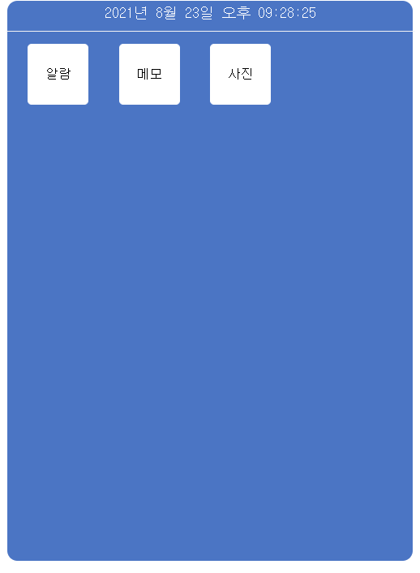


시작페이지는 위와 같이 상단부에는 현재 시각, 그리고 중단부에는 애플리케이션이 있습니다. 
</br></br>


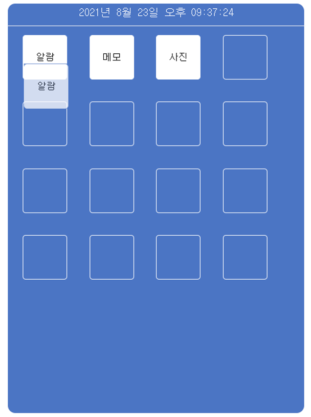


애플리케이션을 drag하면, 애플리케이션을 이동시킬 수 있는 영역이 표시됩니다.
</br></br>


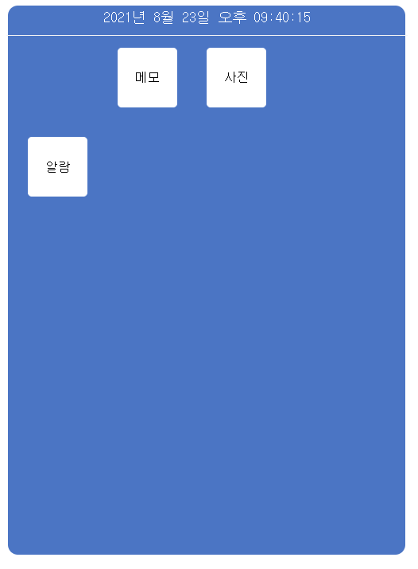

애플리케이션을 원하는 위치에 drop하면, 해당 위치로 애플리케이션을 옮길 수 있습니다.

(또한, 애플리케이션 간의 위치도 바꿀 수 있습니다.)
</br></br>

## 3.2 메모


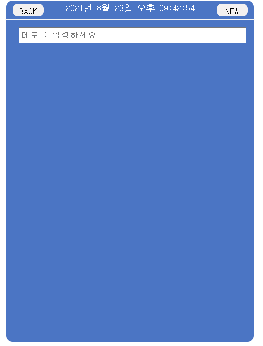


시작페이지에서 <b>메모</b>를 클릭하고, 좌측 상단의 <b>NEW</b>버튼을 클릭하면 하단에 입력창이 나타납니다.
</br></br>


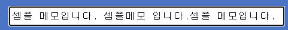


입력창에 메모할 내용을 입력한 후, <b>ENTER</b>키를 누르면 메모가 입력됩니다.
</br></br>

<div display = "flex" flex-direction="row" justify-content="space-evenly">
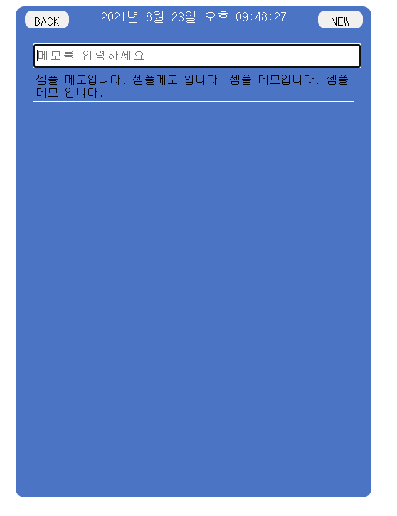

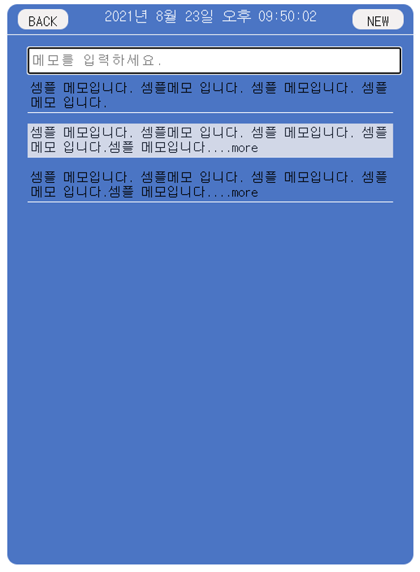
</div>


입력한 메모가 2줄이 초과되는 경우, 2줄까지 표시되며 뒤에 초과되었음을 의미하는 <b>...more</b>가 붙습니다.

또한 해당 메모에 마우스를 올리면 해당 메모를 펼칠 수 있음을 의미하는 흰 표시가 나타납니다.
</br></br>


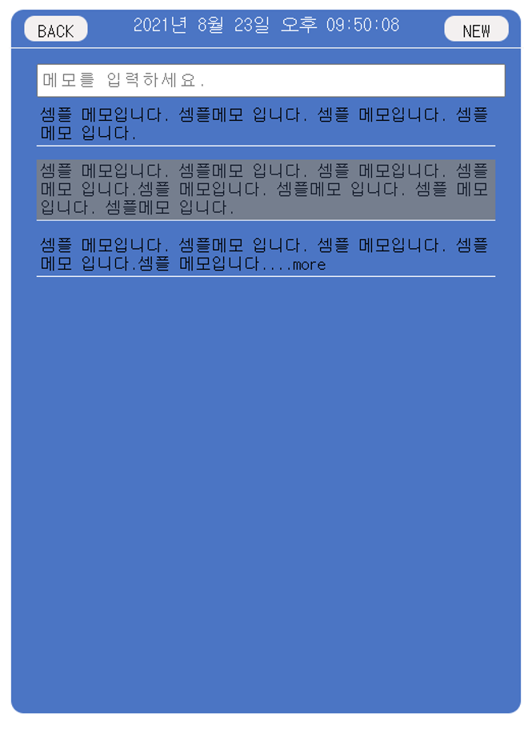


해당 메모를 클릭하면, 메모가 펼쳐집니다. 또한, 이를 다시 원래대로 2줄로 줄일 수 있음을 의미하는 회색 표시가 나타납니다.
</br></br>


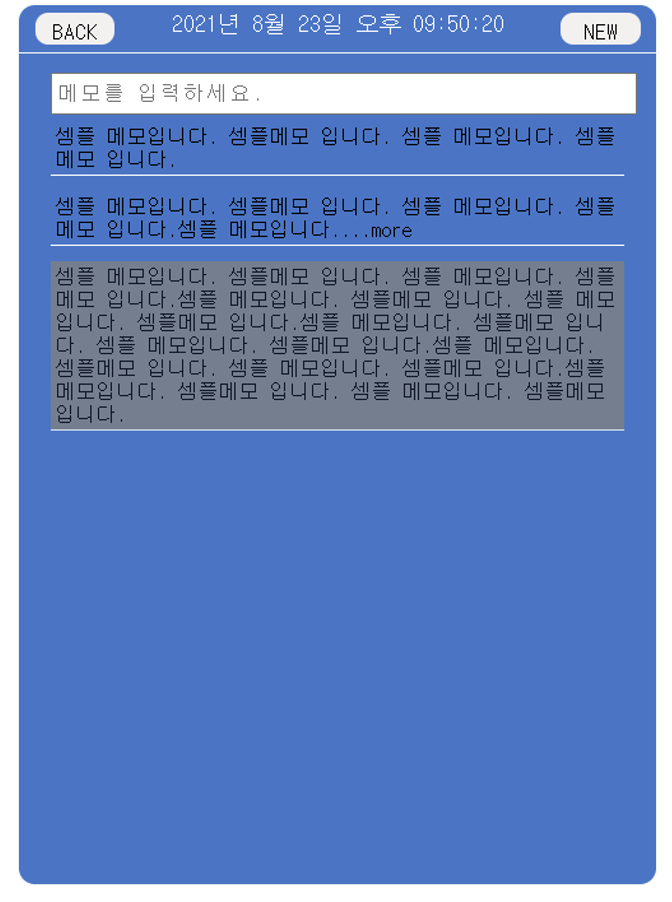


다른 메모를 클릭하면 이전에 펼쳐진 메모가 접히고, 새로 클릭한 메모가 펼쳐집니다. 
</br></br>


## 3.3 알람


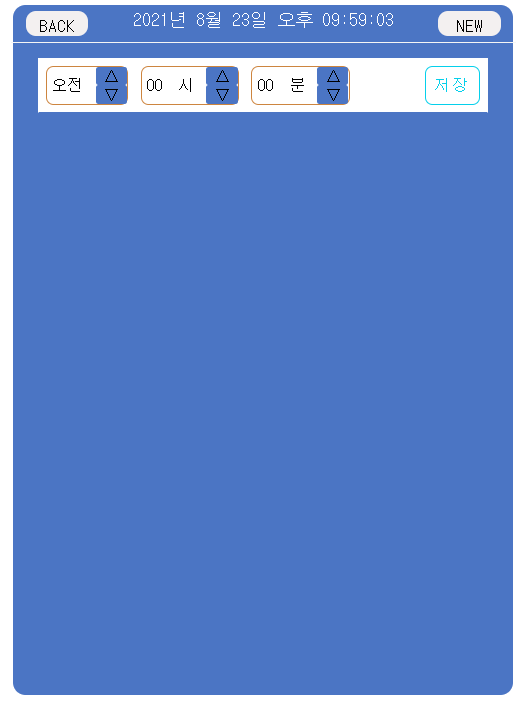


시작페이지에서 <b>메모</b>를 클릭하고, 좌측 상단의 <b>NEW</b>버튼을 클릭하면 하단에 알람 추가창이 나타납니다.
</br></br>


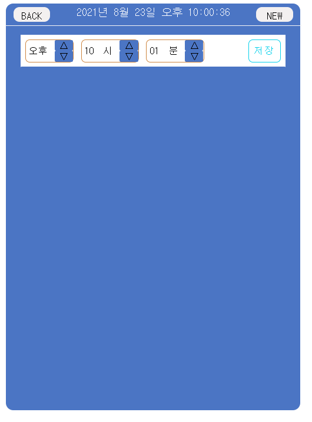


각 버튼을 클릭하여 알람을 설정합니다.
</br></br>


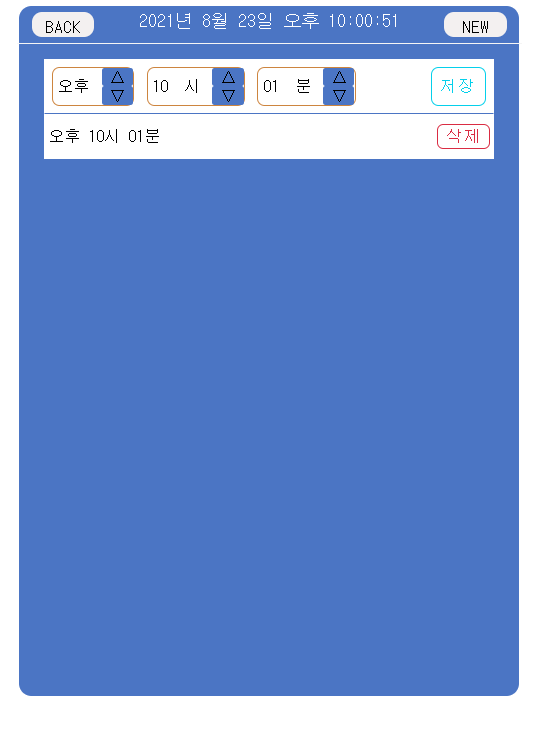


저장 버튼을 누르면 알람이 추가됩니다.
</br></br>
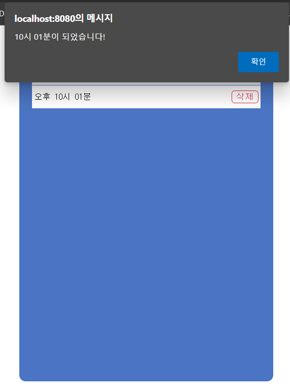


정해진 시간이 되면 Alert 창이 표시되며,
</br></br>


Alert 창을 클릭하면 해당 알람이 제거됩니다.
</br></br>


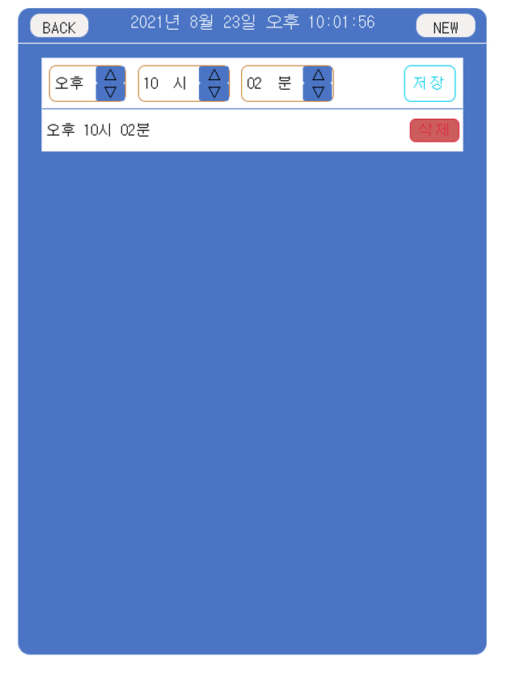


추가한 알람마다 포함되어있는 <b>삭제</b> 버튼을 누르면,
</br></br>


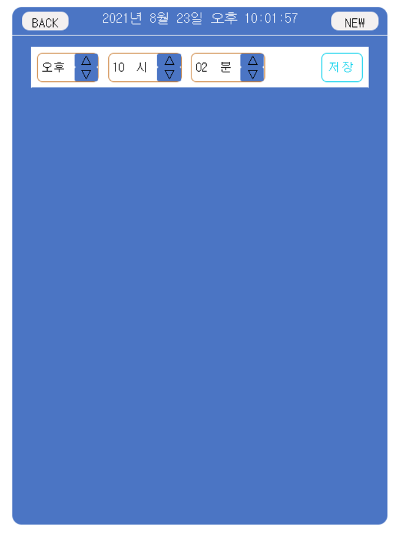

해당 알람이 제거됩니다.

※ 현재 시간과 같은 시간을 등록하는 경우 즉시 알람이 작동하며, 현재 시간보다 이전의 시간을 저장하는 경우에는 다음 날의 해당 시간으로 알람을 설정하게 했습니다.

(ex. 현재 시각은 23일 10시 10분인데, 10시 5분을 알람으로 저장하는 경우, 24일 10시 5분으로 알람이 저장.)
</br></br>
## 3.4 사진


시작페이지에서 <b>사진</b>을 클릭하면 위와 같이 사진의 리스트가 나타납니다.
</br></br>


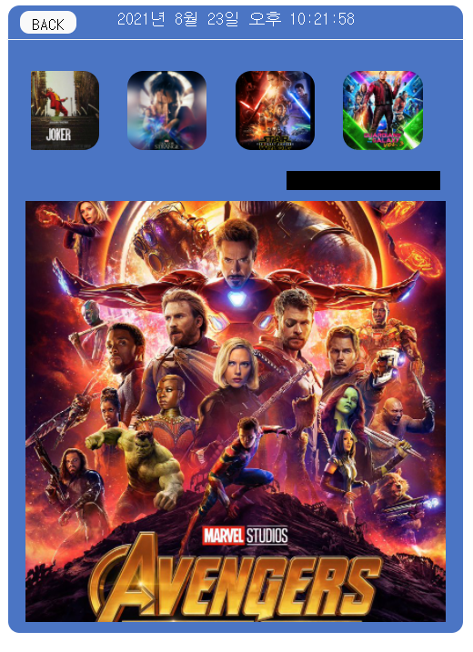

사진 리스트의 하단에 있는 스크롤바를 이동시켜 나머지 사진 리스트를 확인할 수 있습니다.
</br></br>


사진을 클릭하면 해당 사진이 선택되었다는 표시가 나타나며, 해당 사진이 하단에 확대해서 나타납니다.
</br></br>
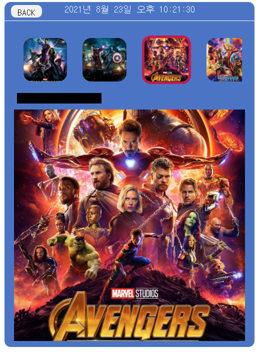


다른 사진을 클릭하면 즉시 다른 사진으로 전환됩니다.
